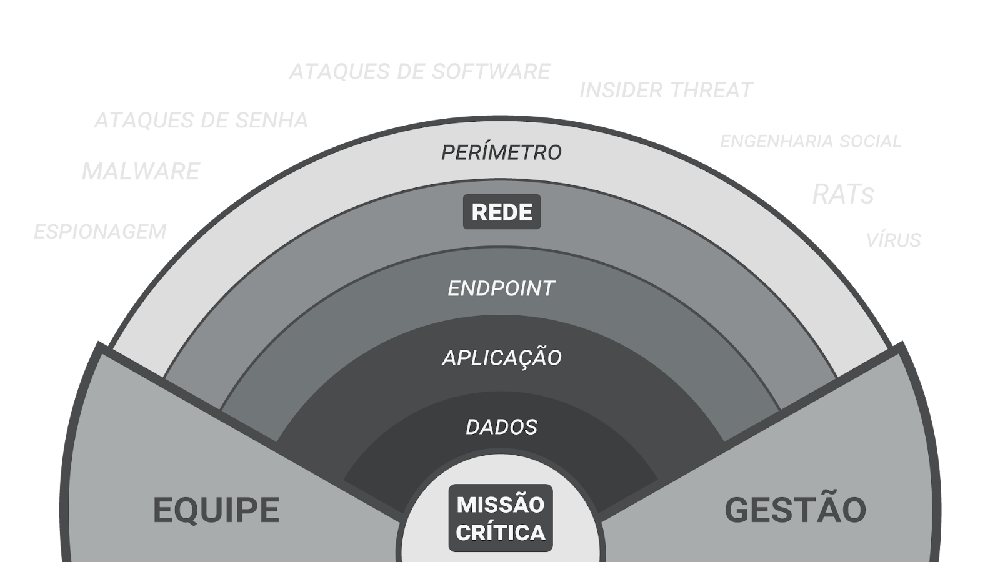

## **Segurança em Camadas (Defesa em Profundidade)**

O conceito de **Defesa em Profundidade** (*Defense-in-Depth*) baseia-se na aplicação de múltiplos controles de segurança distribuídos em diversas camadas para proteger os ativos críticos da organização. A lógica é que, como nenhum controle é infalível, se um invasor conseguir romper uma barreira (ex: o firewall), ele encontrará camadas subsequentes (ex: criptografia ou autenticação) que dificultarão ou impedirão a progressão do ataque.

---

## **As Camadas de Proteção**

De acordo com a visão integrada de segurança física, de redes e de software, a defesa deve ser estruturada da seguinte forma:

### **1. Segurança Física e Perimetral**
É a primeira linha de defesa, focada em proteger o acesso físico ao ambiente onde os ativos residem.
- **Anéis de Proteção:** Utiliza barreiras externas (cercas, muros), controles no prédio (recepção, portas blindadas) e controles no local de trabalho (áreas de acesso restrito via biometria ou crachá).
- **Proteção Ambiental:** Sistemas contra incêndio, enchentes, picos de energia (UPS/Geradores) e refrigeração adequada para manter a disponibilidade dos sistemas.

### **2. Segurança de Rede**
Focada em proteger a comunicação e o tráfego de dados entre os dispositivos.
- **Fronteira de Confiança:** Uso de firewalls e roteadores configurados para filtrar serviços desnecessários e impedir o acesso externo direto à rede interna.
- **Criptografia no Transporte:** Uso de protocolos seguros (TLS/SSL) para garantir que os dados trafegados não sejam interceptados por ataques de monitoramento (*Sniffing*).

### **3. Segurança da Aplicação (Desenvolvimento Seguro)**
Considera a proteção dentro do próprio software, evitando que falhas de lógica ou bugs de código sejam explorados.
- **O Perímetro do Código:** Validação rigorosa de toda entrada de dados e codificação de saída para prevenir ataques de Injeção (SQL) e XSS.
- **Gestão de Sessão e Autenticação:** Implementação de cookies seguros, autenticação multifator (MFA) e expiração de sessões para evitar roubo de identidade.

### **4. Segurança do Host e Endpoint**
Proteção direta nos dispositivos finais, como computadores de trabalho, servidores e dispositivos móveis.
- **Controle de Malware:** Uso de antivírus e ferramentas de monitoramento em tempo real instaladas em cada máquina.
- **Gestão de Vulnerabilidades:** Aplicação constante de patches e atualizações de sistemas operacionais para fechar brechas conhecidas.

### **5. Segurança dos Dados (O Núcleo)**
A última e mais crítica camada, focada no ativo de maior valor: a informação propriamente dita.
- **Criptografia em Repouso:** Garantir que, mesmo que o servidor seja invadido, os dados armazenados (como senhas e dados bancários) estejam cifrados e ilegíveis.
- **Backup e Integridade:** Cópias de segurança regulares armazenadas em locais distintos e protegidas para garantir a restauração após desastres ou ataques de Ransomware.

### **Pessoas: O Elemento Transversal**
Independentemente da tecnologia, a **conscientização** permeia todas as camadas. Usuários treinados reduzem drasticamente a eficácia de ataques de Engenharia Social e Phishing, impedindo que o invasor ganhe a "chave" para abrir as camadas tecnológicas.

[def]: defesa-em-profundidade.png